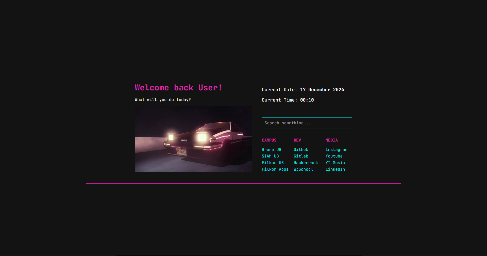

# YASP - Yet Another Start Page

## Description

YASP is my new attempt on creating a perfect browser start page. Silly  reasoning, I know. But I take this as an opportunity to be productive since college finals has already finished.

## Features

There is not a whole lot of features here, but here it is anyway:

1. Search stuff with duckduckgo
2. Nice gif that stares at you
3. links to click on

Thats it btw. Maybe there's more in the future.

## How to use YASP

* ### Firefox via "New Tab Override" Extension

   1. Download the extension from <https://addons.mozilla.org/en-US/firefox/addon/new-tab-override/>
   2. Set the option to "custom URL"
   3. Put the link in the URL bar
   4. Open settings menu
   5. Click the home tab
   6. Change the default new tabs option with New Tab Override
   7. Change the default homepage and new windows option to custom URL (optional)
   8. Insert the github pages link (optional)
   9. You're ready to go!

* ### Google Chrome via "New Tab Redirect" Extension

  1. Download the extension from <https://chromewebstore.google.com/detail/new-tab-redirect/icpgjfneehieebagbmdbhnlpiopdcmna>
  2. Click "set options" right after its finished installing
  3. Change the redirect URL with YASP github page and click save
  4. Open settings and select the On Startup tab
  5. Select the third option and add YASP github page
  6. you're good to go!

## Credits

* GIF: <https://giphy.com/gifs/80s-synthwave-aesthetic-k5zu35npVsYfgZQwwl>
